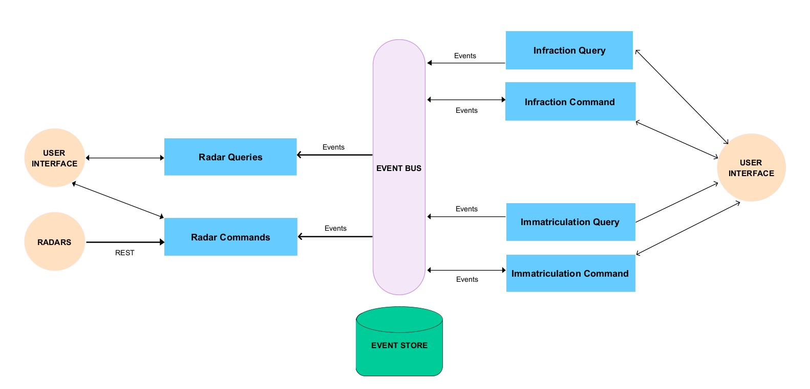

# Examen Blanc : Systèmes Distribués

> Réalisé par : **HACHMI Mohamed Amine**

## Architecture technique du projet :

	
## Diagramme de classes global du projet :
 

------------------------------------------------
## Partie Backend :

-> **Nous allons séparer la partie Command de la partie Query pour tous les services**

### Common-api :

### Radar-Service :

- #### Radar Service Command Side:

- #### Radar Service Query Side:

### Immatriculation Service :

- #### Immatriculation Service Command Side :

- #### Immatriculation Service Query Side :

### Infractions Service :

- #### Infraction Service Command Side :

- #### Infraction Service Query Side :

### Gateway Service :

## Eureka Discovery Service :

------------------------------------------------
-> Nous allons Essayer l'API :

------------------------------------------------
## Partie Frontend :

------------------------------------------------